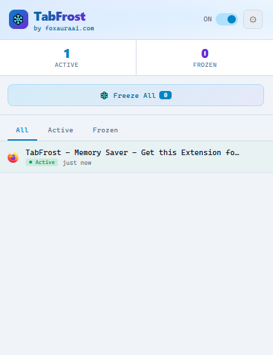
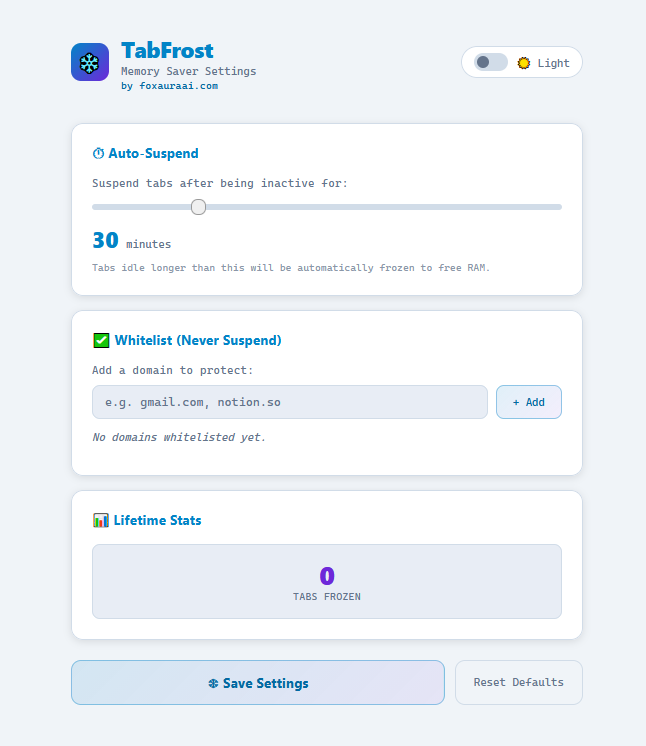

# ❄️ TabFrost – Memory Saver

> Auto-suspend inactive tabs to reclaim RAM. Whitelist sites, set idle timeouts, and keep your browser lean, built by Foxaura AI.
> A lightweight Firefox extension that automatically freezes idle tabs to free memory and speed up your browsing.

[](./LICENSE)
[](https://addons.mozilla.org/en-US/firefox/addon/tabfrost/)
[](https://foxauraai.com)

---

## ✨ Features

- ❄️ **Auto-suspend** — tabs idle longer than a configurable timeout (default 30 min) are automatically discarded to free RAM
- ✅ **Whitelist** — protect important sites (Gmail, Notion, etc.) from ever being suspended
- 🖱️ **Manual freeze** — instantly freeze all freezable tabs with one click, or freeze individual tabs
- 📋 **Tab overview popup** — see active/frozen status, idle time, and per-tab controls (freeze, reload, switch)
- 🔍 **Filter views** — quickly switch between All, Active, and Frozen tab lists
- 🌗 **Light & dark theme** — toggle between themes; persists across sessions
- 📊 **Lifetime freeze counter** — track how many tabs you've frozen over time
- 🔌 **Zero data collection** — fully local, no external requests

---

## 📸 Screenshots

<p align="center">
  
  
</p>

---

## 🚀 Installation

### From Firefox Add-ons (AMO)

Install directly from the [Firefox Add-ons page](https://addons.mozilla.org/en-US/firefox/addon/tabfrost/).

### From Source

1. Clone this repository:
   ```bash
   git clone https://github.com/foxauraai/tabfrost.git
   ```
2. Open Firefox and navigate to `about:debugging`
3. Click **This Firefox** → **Load Temporary Add-on**
4. Select the `manifest.json` file from the cloned folder

---

## 🗂️ Project Structure

```
tabfrost-memory-saver/
├── icons/
│   ├── icon16.png
│   ├── icon48.png
│   └── icon128.png
├── manifest.json       # Extension manifest (MV3)
├── background.js       # Service worker: tab tracking, auto-suspend, alarms
├── popup.html          # Popup UI markup
├── popup.js            # Popup logic: tab list, freeze all, filters
├── options.html        # Settings page markup
├── options.js          # Settings: timer, whitelist, theme, stats
└── README.md
```

---

## ⚙️ Settings

| Setting | Description |
|---|---|
| Auto-Suspend Timer | Set idle timeout from 5 to 120 minutes (default: 30) |
| Whitelist | Add domains that should never be suspended |
| Theme | Toggle between light and dark mode |
| Reset Defaults | Reset timer and freeze count to factory defaults |

---

## 🔒 Privacy

TabFrost collects **no data**. All tab activity timestamps and settings are stored locally in your browser using Firefox's built-in storage APIs and never leave your device. The extension makes no external network requests of any kind.

---

## 🛠️ Built With

- Vanilla JavaScript (no frameworks, no bundler)
- Firefox WebExtensions API (`tabs`, `storage`, `alarms`)
- Chrome DevTools-inspired UI with CSS custom properties

---

## 📄 License

[MIT](./LICENSE) © [Foxaura AI](https://foxauraai.com)
